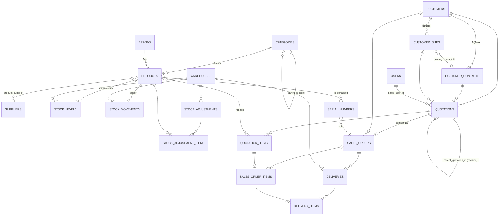

# TEXSON Platform — ERD Phase 1

> อ้างอิง `CLAUDE.md` หัวข้อ 3 (Database Schema) และ 12.2
> สถานะ: **รออนุมัติ** ก่อนเริ่ม Phase 0

## 1. ภาพรวมโดเมน

## 2. รายละเอียดคีย์หลัก (ตัดเฉพาะตารางแกน)

```mermaid
erDiagram
    PRODUCTS {
        id bigint PK
        sku string UK
        name_th string
        name_en string
        category_id bigint FK
        brand_id bigint FK
        model string
        part_number string
        uom enum "pcs/set/box/roll/m"
        cost_price decimal_15_2
        list_price decimal_15_2
        dealer_price decimal_15_2
        project_price decimal_15_2
        is_serialized boolean
        track_lot boolean
        min_stock decimal_15_3
        reorder_qty decimal_15_3
        warranty_months int
        spec json
        deleted_at timestamp
    }
    STOCK_LEVELS {
        id bigint PK
        product_id bigint FK "UK(product,warehouse)"
        warehouse_id bigint FK
        qty_on_hand decimal_15_3
        qty_reserved decimal_15_3
        qty_available decimal "accessor = on_hand - reserved"
    }
    STOCK_MOVEMENTS {
        id bigint PK
        product_id bigint FK
        warehouse_id bigint FK
        type enum "receive/issue/adjust_in/adjust_out/transfer_in/transfer_out/return_in"
        qty decimal_15_3 "signed"
        unit_cost decimal_15_2
        balance_after decimal_15_3
        ref_type string "polymorphic"
        ref_id bigint
        lot_no string
        user_id bigint FK
        moved_at timestamp "IDX(product,warehouse,moved_at)"
    }
    QUOTATIONS {
        id bigint PK
        quote_no string UK "QT-YYYYMM-####"
        revision int
        parent_quotation_id bigint FK
        customer_id bigint FK
        sales_user_id bigint FK
        issue_date date
        valid_until date
        price_tier enum "standard/dealer/project"
        subtotal decimal_15_2
        discount_amount decimal_15_2
        after_discount decimal_15_2
        vat_rate decimal_5_2
        vat_amount decimal_15_2
        grand_total decimal_15_2
        status enum "draft/pending_approval/sent/accepted/rejected/expired/cancelled"
        approved_by bigint FK
        deleted_at timestamp
    }
    QUOTATION_ITEMS {
        id bigint PK
        quotation_id bigint FK
        line_no int
        product_id bigint FK "nullable"
        item_type enum "product/service/labour/freight/note"
        description text "snapshot"
        qty decimal_15_3
        unit_price decimal_15_2 "snapshot"
        discount_percent decimal_5_2
        line_total decimal_15_2
        cost_snapshot decimal_15_2
    }
    NUMBER_SEQUENCES {
        id bigint PK
        doc_type string "UK(doc_type,period)"
        period string "YYYYMM"
        last_no int
    }
```

## 3. เส้นทาง Phase 2 (ยังไม่สร้าง — บันทึกไว้ใน docs/PHASE2-NOTES.md)

`customer_sites` → `assets` → `work_orders` → `service_reports`
`serial_numbers.customer_site_id` = จุดเชื่อมสินค้าที่ขายไปกับ asset ที่ต้องทำ PM
`DocType` enum เตรียมช่องให้ `WO`, `SR`
