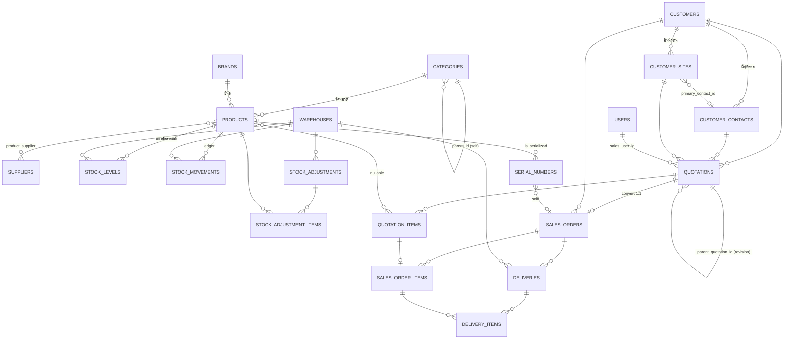

# TEXSON Platform — ERD Phase 1

> อ้างอิง `CLAUDE.md` หัวข้อ 3 (Database Schema) และ 12.2
> สถานะ: **สร้างจริงแล้วถึง Phase 4** — ส่วนที่ต่างจากแบบร่างเดิมสรุปไว้ในหัวข้อ 3

## 1. ภาพรวมโดเมน

## 2. รายละเอียดคีย์หลัก (ตัดเฉพาะตารางแกน)

```mermaid
erDiagram
    PRODUCTS {
        id bigint PK
        sku string UK
        name_th string
        name_en string
        category_id bigint FK
        brand_id bigint FK
        model string
        part_number string
        uom enum "pcs/set/box/roll/m"
        cost_price decimal_15_2
        list_price decimal_15_2
        dealer_price decimal_15_2
        project_price decimal_15_2
        is_serialized boolean
        track_lot boolean
        min_stock decimal_15_3
        reorder_qty decimal_15_3
        warranty_months int
        spec json
        deleted_at timestamp
    }
    STOCK_LEVELS {
        id bigint PK
        product_id bigint FK "UK(product,warehouse)"
        warehouse_id bigint FK
        qty_on_hand decimal_15_3
        qty_reserved decimal_15_3
        qty_available decimal "accessor = on_hand - reserved"
    }
    STOCK_MOVEMENTS {
        id bigint PK
        product_id bigint FK
        warehouse_id bigint FK
        type enum "receive/issue/adjust_in/adjust_out/transfer_in/transfer_out/return_in"
        qty decimal_15_3 "signed"
        unit_cost decimal_15_2
        balance_after decimal_15_3
        ref_type string "polymorphic"
        ref_id bigint
        lot_no string
        user_id bigint FK
        moved_at timestamp "IDX(product,warehouse,moved_at)"
    }
    QUOTATIONS {
        id bigint PK
        quote_no string UK "QT-YYYYMM-####"
        revision int
        parent_quotation_id bigint FK
        customer_id bigint FK
        sales_user_id bigint FK
        issue_date date
        valid_until date
        price_tier enum "standard/dealer/project"
        subtotal decimal_15_2
        discount_amount decimal_15_2
        after_discount decimal_15_2
        vat_rate decimal_5_2
        vat_amount decimal_15_2
        grand_total decimal_15_2
        status enum "draft/pending_approval/sent/accepted/rejected/expired/cancelled"
        cost_total decimal_15_2 "ผลรวม cost_snapshot ทุกบรรทัด"
        approved_by bigint FK
        approved_at timestamp "อนุมัติแล้วแต่ status ยังเป็น pending_approval (ADR-010)"
        superseded_at timestamp "ถูกแทนที่ด้วย revision (ADR-002)"
        deleted_at timestamp
    }
    QUOTATION_ITEMS {
        id bigint PK
        quotation_id bigint FK
        line_no int
        product_id bigint FK "nullable"
        item_type enum "product/service/labour/freight/note"
        description text "snapshot"
        qty decimal_15_3
        unit_price decimal_15_2 "snapshot"
        discount_percent decimal_5_2
        discount_amount decimal_15_2
        line_total decimal_15_2
        sku_snapshot string "snapshot"
        uom string "snapshot"
        cost_snapshot decimal_15_2 "มาจาก products.cost_price เท่านั้น (ADR-013)"
        lead_time_days smallint
    }
    SALES_ORDERS {
        id bigint PK
        so_no string "UK"
        quotation_id bigint FK "UK · nullable (ADR-019)"
        customer_id bigint FK
        warehouse_id bigint FK "คลังที่จองและจ่ายของ (ADR-017)"
        sales_user_id bigint FK
        customer_po_no string
        customer_po_file string "storage/app/private"
        order_date date
        required_date date
        status enum "pending/reserved/partially_delivered/delivered/cancelled"
        grand_total decimal_15_2 "ยกมาจากใบเสนอราคาทั้งชุด"
        confirmed_at timestamp
        deleted_at timestamp
    }
    SALES_ORDER_ITEMS {
        id bigint PK
        sales_order_id bigint FK
        quotation_item_id bigint FK "nullable"
        product_id bigint FK "null = ค่าแรง/ค่าขนส่ง (ADR-020)"
        description text "snapshot"
        unit_price decimal_15_2 "snapshot"
        qty_ordered decimal_15_3
        qty_reserved decimal_15_3 "< qty_ordered ได้ = backorder"
        qty_delivered decimal_15_3
    }
    DELIVERIES {
        id bigint PK
        delivery_no string "UK"
        sales_order_id bigint FK
        warehouse_id bigint FK "คลังที่จ่ายจริง"
        delivery_date date "= warranty_start ของ serial"
        status enum "draft/posted/cancelled"
        receiver_name string
        posted_at timestamp
    }
    DELIVERY_ITEMS {
        id bigint PK
        delivery_id bigint FK
        sales_order_item_id bigint FK
        product_id bigint FK "nullable"
        qty decimal_15_3
        serial_numbers json "เปลี่ยนเป็น sold ตอน post"
        lot_no string
    }
    SETTINGS {
        id bigint PK
        key string "UK · ข้อมูลบริษัท / ค่าเริ่มต้นเอกสาร / เกณฑ์อนุมัติ"
        value json
        group string
    }
    NUMBER_SEQUENCES {
        id bigint PK
        doc_type string "UK(doc_type,period)"
        period string "YYYYMM"
        last_no int
    }
```

## 3. หมายเหตุที่เพิ่มหลังเริ่มลงมือ

| เรื่อง | สรุป | อ้างอิง |
|---|---|---|
| unique ของเลขที่ใบเสนอราคา | เป็นคู่ `(quote_no, revision)` ไม่ใช่ `quote_no` เดี่ยว — ฉบับแก้ไขใช้เลขเดิม | [ADR-009](DECISIONS.md) |
| สถานะ "อนุมัติแล้ว" | ไม่มีใน enum — ใช้ `approved_at` บนใบที่ยังเป็น `pending_approval` | [ADR-010](DECISIONS.md) |
| ถูกแทนที่ | `superseded_at` แยกจาก `status` เพื่อไม่ให้รายงาน win rate เพี้ยน | [ADR-002](DECISIONS.md) |
| ต้นทุนในบรรทัด | เขียนทับจาก `products.cost_price` เสมอ ไม่รับจากฟอร์ม | [ADR-013](DECISIONS.md) |
| เอกสารคลัง | `goods_receipts` และ `stock_transfers` เพิ่มเข้ามาเติมช่องว่างของ `ref_type` | [ADR-005](DECISIONS.md) |
| คลังของใบสั่งขาย | เพิ่ม `sales_orders.warehouse_id` — จองของต้องรู้ว่าจองจากคลังไหน | [ADR-017](DECISIONS.md) |
| จังหวะการจอง | สร้างเป็น `pending` → กดยืนยันจึงจอง | [ADR-018](DECISIONS.md) |
| ที่มาของใบสั่งขาย | แปลงจากใบเสนอราคาเท่านั้น · `quotation_id` unique | [ADR-019](DECISIONS.md) |
| บรรทัดที่ไม่มีของ | `product_id` null → ส่งมอบได้แต่ไม่แตะ ledger | [ADR-020](DECISIONS.md) |

## 4. เส้นทาง Phase 2 (ยังไม่สร้าง — บันทึกไว้ใน docs/PHASE2-NOTES.md)

`customer_sites` → `assets` → `work_orders` → `service_reports`
`serial_numbers.customer_site_id` = จุดเชื่อมสินค้าที่ขายไปกับ asset ที่ต้องทำ PM
`DocType` enum เตรียมช่องให้ `WO`, `SR`
