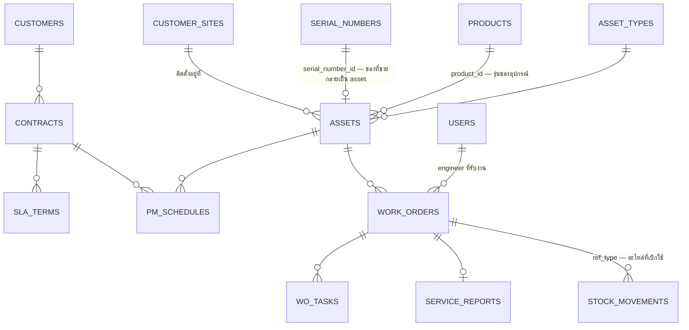

# Phase 2 — Work Order / PM / CM (ยังไม่เริ่มทำ)

เอกสารนี้บันทึกไว้ตาม [CLAUDE.md](../CLAUDE.md) ข้อ 9 เพื่อให้ schema ของ Phase 1 ต่อยอดได้โดย **ไม่ต้อง refactor ตารางเดิม**

> **สถานะ:** เป็นบันทึกการออกแบบล่วงหน้าเท่านั้น — ยังไม่สร้าง migration, model หรือ UI ใด ๆ ของ Phase 2

---

## ตารางที่จะเพิ่ม

| ตาราง | หน้าที่ |
|---|---|
| `asset_types` | ประเภทอุปกรณ์ที่ต้องดูแล (UPS, CRAC, Generator, Fire Panel …) + รอบ PM มาตรฐาน |
| `assets` | อุปกรณ์ที่ติดตั้งจริงหน้างานลูกค้า — ทะเบียนทรัพย์สินหลักของ Phase 2 |
| `contracts` | สัญญาบริการ/MA รายลูกค้า (ช่วงเวลา, ขอบเขต, มูลค่า) |
| `sla_terms` | เงื่อนไข SLA ต่อสัญญา (response time, resolution time, ชั่วโมงให้บริการ) |
| `pm_schedules` | แผน PM ตามรอบ (รายเดือน/ไตรมาส/ปี) ผูกกับ asset หรือ contract |
| `work_orders` | ใบสั่งงาน PM/CM — เอกสารหลักของ Phase 2 |
| `wo_tasks` | รายการงานย่อยในใบสั่งงาน + ผู้รับผิดชอบ + สถานะ |
| `checklists` | เทมเพลตรายการตรวจตาม asset type |
| `service_reports` | รายงานผลหลังปิดงาน + ลายเซ็นลูกค้า → ออก PDF |

---

## จุดเชื่อมกับตารางของ Phase 1

| ตารางเดิม (Phase 1) | เชื่อมอย่างไร |
|---|---|
| `customer_sites` | `assets.customer_site_id` — ใช้งานจริงตั้งแต่ Phase 1 แล้ว (ใบเสนอราคาเลือก site ได้) |
| `serial_numbers` | `assets.serial_number_id` — แบตเตอรี่/UPS ที่ขายไปกลายเป็น asset ที่ต้องทำ PM ต่อ · `serial_numbers.customer_site_id` ถูกตั้งไว้ตอน post delivery แล้ว |
| `products` | `assets.product_id` — รู้รุ่น/สเปก/ระยะประกันของอุปกรณ์หน้างาน |
| `stock_movements` | `ref_type = WorkOrder` — การเบิกอะไหล่ไปใช้ในงาน CM เขียนลง ledger เดิม **ไม่ต้องสร้างตารางใหม่** |
| `customers` | `contracts.customer_id` |
| `users` | `work_orders.engineer_user_id` — role `engineer` มีอยู่แล้วตั้งแต่ Phase 1 |
| `attachments` | polymorphic อยู่แล้ว — แนบรูปหน้างาน/ใบเซ็นรับงานได้ทันที |
| `settings` | เพิ่ม group `service` สำหรับค่าเริ่มต้นของ SLA และเลขเอกสาร WO/SR |

---

## สิ่งที่ Phase 1 ต้องเตรียมไว้ให้

- [ ] `App\Enums\DocType` ต้องเพิ่มค่า `WO` และ `SR` ได้โดยไม่กระทบ `number_sequences` (ตารางเก็บ `doc_type` เป็น string อยู่แล้ว)
- [ ] `stock_movements.ref_type` ต้องเป็น polymorphic แบบไม่ผูก enum — รับ `WorkOrder` ได้ในอนาคต
- [ ] `serial_numbers.status` ต้องมีค่า `installed` (มีในสเปกข้อ 3.2 แล้ว) เพื่อเป็นสะพานไปสู่ asset
- [ ] **ห้าม**ใส่ business logic ของ work order ลงใน service ฝั่ง sales — `StockService` ต้องรับ `ref` แบบ generic ไม่ผูกกับ `Delivery` ตรง ๆ

---

## สิ่งที่ยังไม่ตัดสินใจ

- PM ที่ใช้อะไหล่จากสต็อกรถ (`VAN`) จะตัดสต็อกตอนเบิกขึ้นรถ หรือตอนปิดงานหน้างาน
- ใบสั่งงาน CM ที่มีค่าใช้จ่าย จะออกใบเสนอราคาก่อนเสมอ หรือให้ปิดงานแล้วตั้งเบิกทีหลังได้
- SLA breach จะคิดจากเวลาที่ลูกค้าแจ้ง หรือเวลาที่ระบบสร้างใบสั่งงาน
